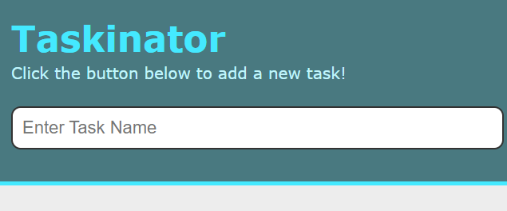

# taskinator

## Overview: 

In Module 4 of the UNC Code Camp I learned about the Document Object Model (DOM) and how to incorporate it within JavaScript to create a dynamic task planner. The planner uses local storage to save and retrieve tasks.  

View live site at: https://reinholz36.github.io/taskinator/

 
## Technologies used: 
  * JavaScript